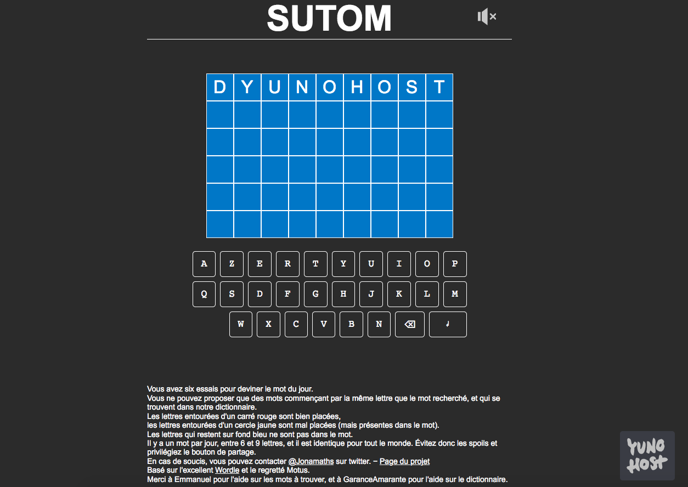

<!--
N.B.: README ini dibuat secara otomatis oleh <https://github.com/YunoHost/apps/tree/master/tools/readme_generator>
Ini TIDAK boleh diedit dengan tangan.
-->

# Sutom untuk YunoHost

[](https://ci-apps.yunohost.org/ci/apps/sutom/)


[](https://install-app.yunohost.org/?app=sutom)

*[Baca README ini dengan bahasa yang lain.](./ALL_README.md)*

> *Paket ini memperbolehkan Anda untuk memasang Sutom secara cepat dan mudah pada server YunoHost.*  
> *Bila Anda tidak mempunyai YunoHost, silakan berkonsultasi dengan [panduan](https://yunohost.org/install) untuk mempelajari bagaimana untuk memasangnya.*

## Ringkasan

Jeu de lettres en ligne (et en français) basé sur Wordle. Le jeu se trouve à l'adresse https://sutom.nocle.fr


**Versi terkirim:** 2023.06.13~ynh1

**Demo:** <https://sutom.nocle.fr/>

## Tangkapan Layar



## Dokumentasi dan sumber daya

- Website aplikasi resmi: <https://sutom.nocle.fr/>
- Depot kode aplikasi hulu: <https://framagit.org/JonathanMM/sutom>
- Gudang YunoHost: <https://apps.yunohost.org/app/sutom>
- Laporkan bug: <https://github.com/YunoHost-Apps/sutom_ynh/issues>

## Info developer

Silakan kirim pull request ke [`testing` branch](https://github.com/YunoHost-Apps/sutom_ynh/tree/testing).

Untuk mencoba branch `testing`, silakan dilanjutkan seperti:

```bash
sudo yunohost app install https://github.com/YunoHost-Apps/sutom_ynh/tree/testing --debug
atau
sudo yunohost app upgrade sutom -u https://github.com/YunoHost-Apps/sutom_ynh/tree/testing --debug
```

**Info lebih lanjut mengenai pemaketan aplikasi:** <https://yunohost.org/packaging_apps>
